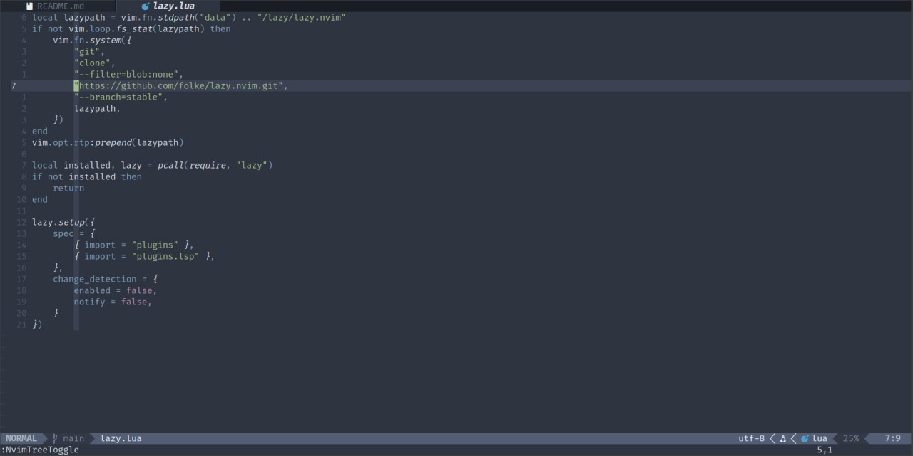
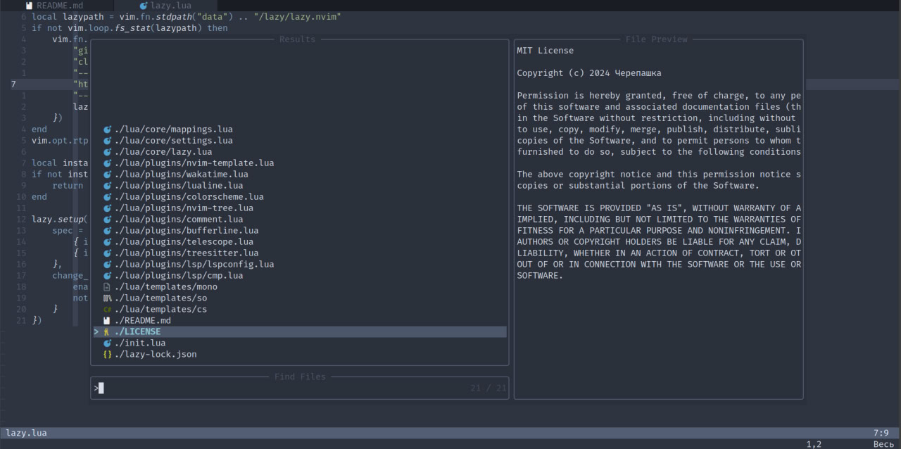

# nvim-config

<div>
    
    
    
</div>

# Plugins
| Name | Dependencies |
| --- | --- |
| [Lazy](https://github.com/folke/lazy.nvim) | none |
| [Nvim-lspconfig](https://github.com/neovim/nvim-lspconfig) | lsp servers |
| [Nvim-cmp](https://github.com/hrsh7th/nvim-cmp) | [cmp-nvim-lsp](https://github.com/hrsh7th/cmp-nvim-lsp), [cmp-buffer](https://github.com/hrsh7th/cmp-buffer), [cmp-path](https://github.com/hrsh7th/cmp-path), [cmp-cmdline](https://github.com/hrsh7th/cmp-cmdline) |
| [Bufferline](https://github.com/akinsho/bufferline.nvim) | [nvim-web-devicons](https://github.com/nvim-tree/nvim-web-devicons) |
| [Nordic](https://github.com/andersevenrud/nordic.nvim) (colorscheme) | none |
| [Comment](https://github.com/numToStr/Comment.nvim) | none |
| [Lualine](https://github.com/nvim-lualine/lualine.nvim) | [nvim-web-devicons](https://github.com/nvim-tree/nvim-web-devicons) |
| [Telescope](https://github.com/nvim-telescope/telescope.nvim) | [plenary](https://github.com/nvim-lua/plenary.nvim) |
| [Nvim-treesitter](https://github.com/nvim-treesitter/nvim-treesitter) | none |
| [Nvim-tree](https://github.com/nvim-tree/nvim-tree.lua) | [nvim-web-devicons](https://github.com/nvim-tree/nvim-web-devicons) |
| [Nvim-template](https://github.com/qdiaps/nvim-template) | none |
| [Vim-wakatime](https://github.com/wakatime/vim-wakatime) | none |

# Lsp servers
* [Clangd](https://clangd.llvm.org/installation.html)
* [Csharp_ls](https://github.com/razzmatazz/csharp-language-server)
* [Cmake](https://github.com/regen100/cmake-language-server)
* [Lua_ls](https://github.com/luals/lua-language-server)

# How to add new plugin
1. Open folder `lua/plugins`.
2. Create a file to customize the plugin.
3. Add configuration:
```lua
return {
    "name/plugin",
    -- other_options = ...,
    config = function()
        require("plugin").setup({
            -- options...
        })
    end,
}
```
4. Re-open NeoVim.
